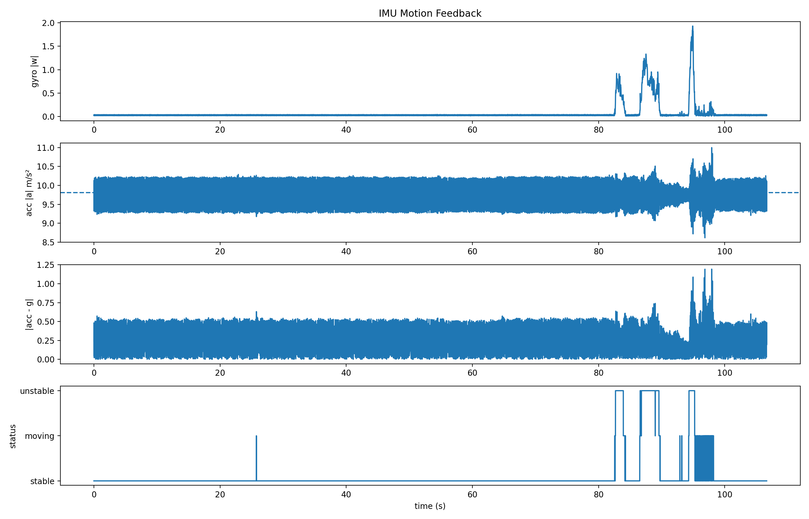
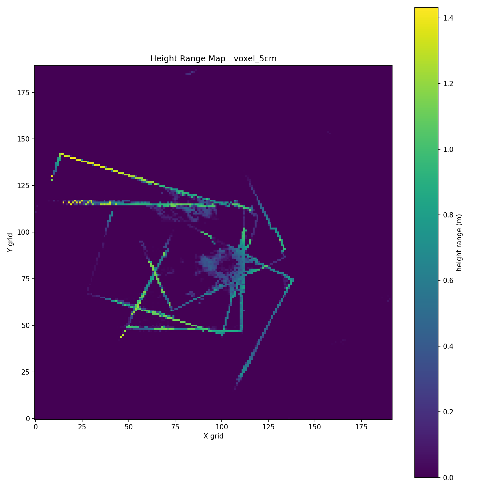
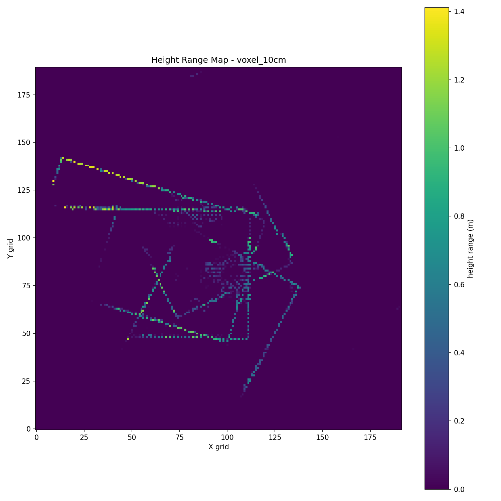
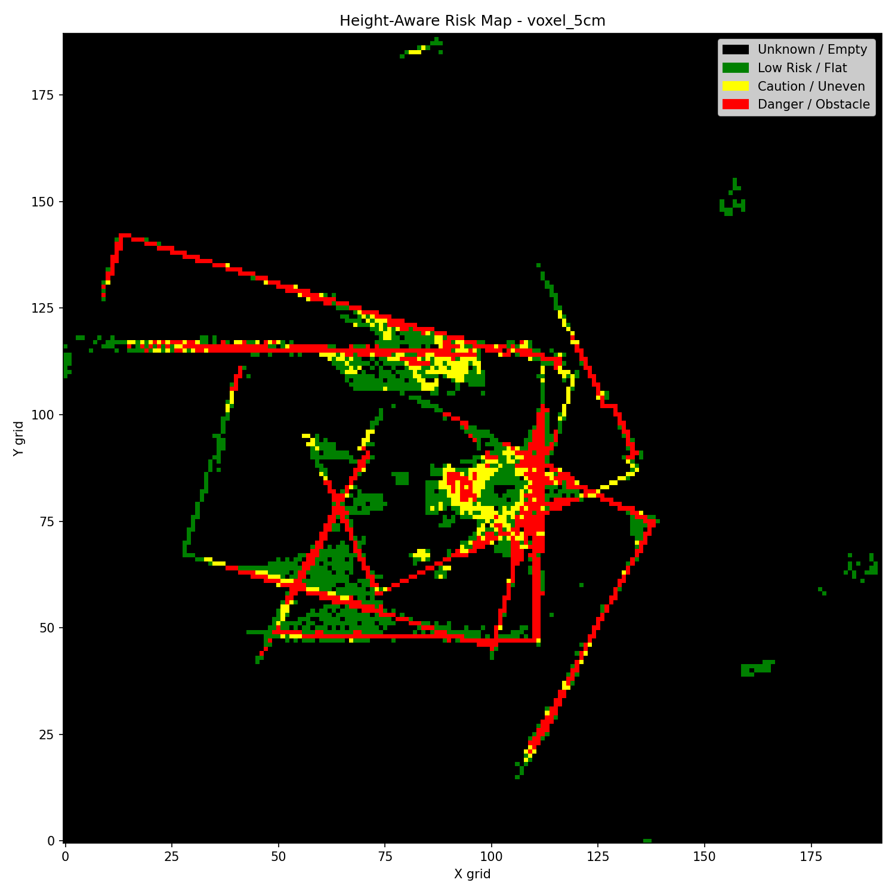
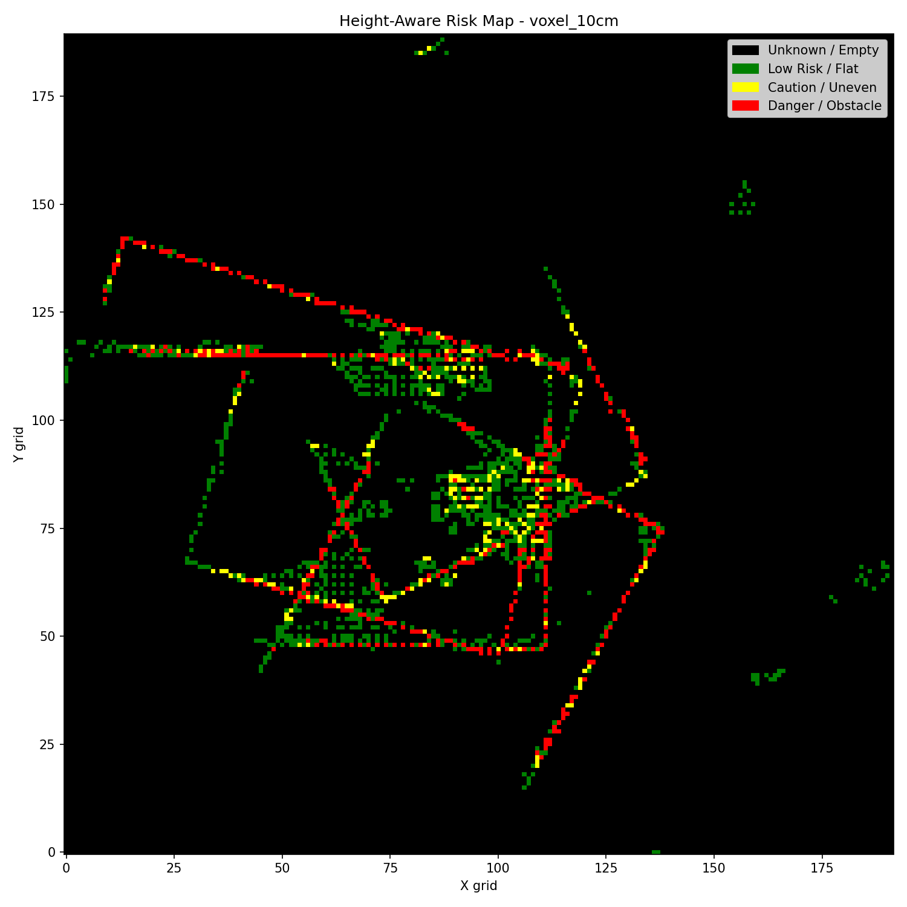
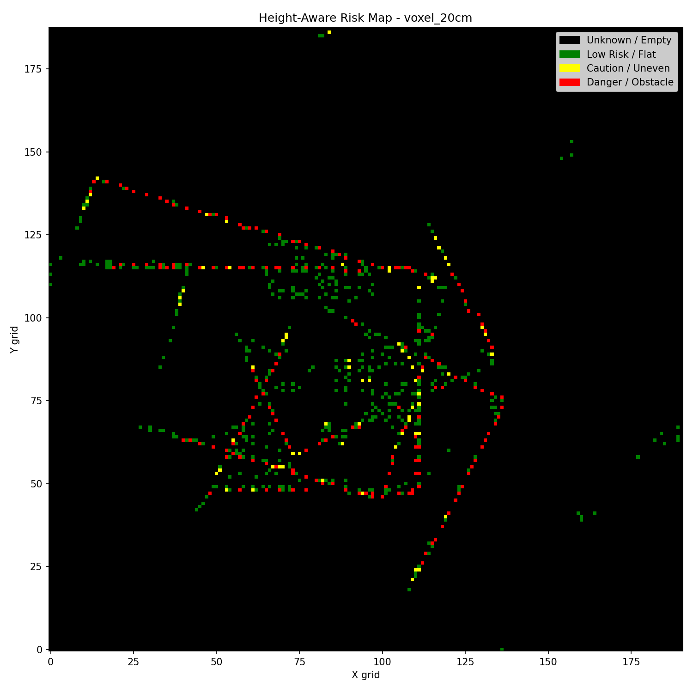

# LiDAR–IMU Autonomous Perception Platform

A portable 3D sensing and perception platform built around a **Livox Mid-360S LiDAR**, IMU, Raspberry Pi, ROS 2, Python, and C++.

The project focuses on building a complete perception pipeline that can evolve from raw sensor acquisition into:

- 3D environment understanding
- LiDAR–IMU localization and SLAM
- terrain / obstacle risk analysis
- decision support
- autonomous navigation
- future UAV deployment

The current system already supports real-time sensor acquisition, point-cloud processing, voxel-based environment analysis, IMU motion analysis, and height-aware risk mapping.

---

## System Overview

Current validated pipeline:

```text
Livox Mid-360S LiDAR
        +
       IMU
        ↓
ROS 2 Sensor Interface
        ↓
PointCloud2 + IMU Streaming
        ↓
Recording / PLY Export
        ↓
Point-Cloud Filtering
        ↓
Voxel Processing
        ↓
Height / Occupancy Analysis
        ↓
Terrain & Obstacle Risk Mapping
```

The next stages extend this toward:

```text
LiDAR + IMU
    ↓
Motion Compensation
    ↓
Scan Matching
    ↓
Pose Estimation
    ↓
SLAM / Localization
    ↓
Environment Understanding
    ↓
Decision Model
    ↓
Path / Action Selection
    ↓
Autonomous Navigation
```

---

## Hardware Platform

Current hardware includes:

- **Livox Mid-360S LiDAR**
- Raspberry Pi
- IMU
- SSD storage
- portable battery system
- Ethernet communication
- 3D-printed mechanical integration
- headless Linux operation

A parallel **5-inch FPV UAV platform** is also being developed for future aerial deployment.

---

## Software Stack

### Robotics / Systems
- ROS 2
- Livox SDK2
- Linux
- C++
- Python

### Data / Processing
- NumPy
- pandas
- point-cloud processing
- voxel downsampling
- occupancy analysis
- height-based environment analysis

### Visualization
- RViz
- Matplotlib
- PLY point-cloud export

---

## Current Validated Capabilities

Implemented and tested:

- Real-time Livox LiDAR acquisition
- ROS 2 `PointCloud2` publishing
- Approximately **200 Hz IMU streaming**
- Sensor-data recording
- Headless data acquisition
- SSD-based storage
- PLY export
- Confidence filtering
- Voxel downsampling
- Occupancy mapping
- Density-based environment analysis
- Height-range analysis
- Height-aware terrain / obstacle risk mapping
- IMU motion-state analysis

---

## IMU Motion Analysis

IMU data is used to characterize sensor motion during acquisition.

Current analysis considers:

- gyroscope magnitude
- acceleration magnitude
- deviation from gravitational acceleration
- stable / moving / unstable motion states

This motion feedback will later support:

- motion compensation
- scan alignment
- pose estimation
- LiDAR–IMU sensor fusion

### Example IMU Result



---

## Voxel-Based Environment Analysis

Raw LiDAR point clouds are converted into voxelized representations for more efficient spatial analysis.

Current tested voxel resolutions include:

- 5 cm
- 10 cm
- 20 cm

The voxelized data is used for:

- point-cloud compression
- local height variation
- occupancy analysis
- terrain-risk classification

---

## Height-Range Mapping

Each spatial cell is analyzed using local vertical variation.

Conceptually:

```text
height_range = max(z) - min(z)
```

for points inside a local voxel or grid region.

This helps identify:

- flat ground
- uneven terrain
- vertical structures
- obstacles
- geometry transitions

### 5 cm Height-Range Map



### 10 cm Height-Range Map



### 20 cm Height-Range Map


---

## Height-Aware Risk Mapping

A height-aware risk layer converts local geometric variation into a more interpretable environment representation.

Current categories include:

- **Low Risk / Flat**
- **Caution / Uneven**
- **Danger / Obstacle**
- **Unknown / Empty**

### 5 cm Risk Map



### 10 cm Risk Map



### 20 cm Risk Map



These maps are intended to provide higher-level spatial information for future decision-making and autonomous navigation.

---

## LiDAR–IMU SLAM

The current SLAM development focuses on combining LiDAR geometry with IMU motion information for localization and mapping.

Target pipeline:

```text
IMU Motion Estimate
        +
LiDAR Scan Matching
        ↓
Pose Estimation
        ↓
Local Mapping
        ↓
Loop Closure
        ↓
Global 3D Map
```

Current development topics include:

- LiDAR scan matching
- IMU motion compensation
- coordinate-frame transformations
- sensor calibration
- drift reduction
- pose estimation
- loop closure
- ROS 2 TF integration

---

## Decision Model

A later stage of the project will use perception outputs to support autonomous decision-making.

Intended structure:

```text
Perception Outputs
  ├── obstacle map
  ├── terrain risk
  ├── occupancy
  ├── localization
  └── motion state
        ↓
Decision Model
        ↓
Candidate Actions
        ↓
Risk / Cost Evaluation
        ↓
Selected Action
```

The future decision model will consider:

- obstacle proximity
- terrain risk
- traversability
- sensor confidence
- localization confidence
- mission objectives

Potential approaches include:

- rule-based decision systems
- cost functions
- graph search
- machine-learning-based decision models
- reinforcement-learning-based policies

These components are planned and are not yet considered completed functionality.

---

## Autonomous Navigation Architecture

Long-term autonomy stack:

```text
Sensors
   ↓
Perception
   ↓
Localization
   ↓
Mapping
   ↓
Risk / Obstacle Understanding
   ↓
Decision Model
   ↓
Path Planning
   ↓
Control Commands
   ↓
Autonomous Navigation
```

The goal is to move beyond isolated perception algorithms and build a complete system that functions reliably on real hardware.

---

## UAV Integration

A parallel 5-inch FPV UAV platform has been assembled to build hands-on experience with real flight hardware.

The UAV platform includes:

- F4 flight controller
- 45A ESC
- brushless motors
- FPV camera
- video transmitter
- radio hardware
- power wiring
- soldering
- mechanical integration

The longer-term goal is to deploy a lightweight version of the perception stack onto an aerial platform.

Target UAV architecture:

```text
LiDAR / IMU / Camera
        ↓
Companion Computer
        ↓
ROS 2 Perception
        ↓
SLAM / Localization
        ↓
Obstacle / Local Map
        ↓
Decision / Planning
        ↓
Flight Controller
        ↓
Autonomous Navigation
```

---

## Testing

### Bench Testing

Validated:

- Ethernet communication
- LiDAR streaming
- IMU acquisition
- ROS 2 publishing
- data recording
- PLY export
- SSD logging
- point-cloud filtering
- voxel processing

### Portable Testing

Current testing focuses on:

- portable power
- headless startup
- reliable sensor recording
- cable management
- mechanical stability
- continuous storage

### Field Testing

Field testing will evaluate:

- point-cloud quality during motion
- IMU behavior
- mapping consistency
- power endurance
- data integrity
- sensing reliability in GPS-limited environments

---

## Current Development

Current focus areas:

- portable field-data acquisition
- LiDAR–IMU motion compensation
- scan matching
- pose estimation
- ROS 2 TF
- SLAM
- improved 3D reconstruction

---

## Roadmap

Planned development:

1. LiDAR–IMU SLAM
2. camera–LiDAR calibration
3. colorized 3D reconstruction
4. real-time obstacle mapping
5. decision model
6. path planning
7. PX4 / flight-controller integration
8. UAV simulation
9. autonomous aerial navigation
10. deployment in GPS-denied environments

---

## Repository Structure

```text
LiDAR-IMU-Autonomous-Perception/
├── data/
├── outputs/
│   └── compression_maps/
├── scripts/
│   └── outputs/
├── requirements.txt
├── .gitignore
└── README.md
```

---

## Project Status

**Active development — 2026**

Current validated system:

```text
LiDAR / IMU
    ↓
ROS 2 acquisition
    ↓
recording / export
    ↓
point-cloud filtering
    ↓
voxel processing
    ↓
environment analysis
    ↓
height-aware risk mapping
```

In development:

```text
SLAM
→ localization
→ decision model
→ planning
→ UAV autonomy
```

---

## Author

**Tom Li**  
Computer Engineering — University of Waterloo

Areas of interest:

- Robotics
- Autonomous Systems
- LiDAR
- SLAM
- Sensor Fusion
- Embedded Systems
- UAVs
- Computer Vision
- AI

GitHub: [Ashen2-1](https://github.com/Ashen2-1)
